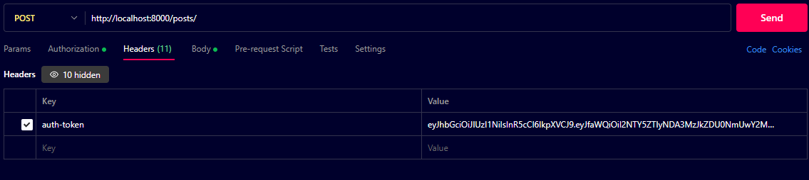

# Project Name - API Documentation

## Overview

This project provides a set of RESTful APIs for managing users, posts, and comments. It allows users to create, view, and edit their profiles, create posts, retrieve posts, and comment on posts.

## Base URL

The base URL for all endpoints is: `http://localhost:8000/`

## To Run

### 1.npm install 2.npm start

## Authentication

Authentication is required for certain endpoints.

#### When checking the protected routes in postman , for that particular api, `In headers, put key = auth-token and value = TOKEN (which will be generated) `

##### 

## Very important:

#### UserId: \_id of the user collection (Created when user is registered for the first time)

#### ProfileId: \_id of the profile collection (A user can only create his profile if he logs in)

#### PostId: \_id of the post collection (A user can only create posts if he logs in and he has a profile)

#### CommentId: \_id of the comment (Someone need all 3 above to create comment)

## NOTE:

#### When checking the protected routes in postman ,Go to headers , put key = auth-token and value = TOKEN

### Register User

- **Endpoint:** `/users/register`
- **Method:** `POST`
- **Description:** Register a new user by providing username, email, and password in the request body.
- **Request Body:**
  ```json
  {
    "username": "example_user",
    "email": "user@example.com",
    "password": "password123"
  }
  ```

Login User

Endpoint: `/users/login`
Method: POST
Description: Authenticate and log in a user. Provide email and password in the request body.

Request Body:

```json
{
  "email": "user@example.com",
  "password": "password123"
}
```

Response: Returns a JWT token if successful for further authentication.

User Profile Management
</br>

```json
Create Profile
Endpoint: /profile
Method: POST
Description: Create a newProfile.
Authorization: Bearer Token (JWT)
```

</br>

```json
{
  "userId": "mongodb _id of the resopective user collection",
  "fullName": "ankan",
  "bio": "optional"
}
```

Response: Profile details if successful.

```json
Get User Profile
Endpoint: /profile/:profileId
Method: GET
Description: Retrieve user profile details by user ID.
Authorization: Bearer Token (JWT)
Response: User profile details if found.
```

```json
Update User Profile
Endpoint: /profile/:profileId
Method: PUT
Description: Update user profile details.
Authorization: Bearer Token (JWT)

Request Body: Updated user profile fields
Response: Updated user profile details.
```

Posts
Post Creation and Retrieval

```json
Create Post
Endpoint: /posts
Method: POST
Description: Create a new post.
Authorization: Bearer Token (JWT)
```

Request Body:

```json
{
"title": "Post Title",
"content": "Post Content",
"userId":"mongodb \_id of the resopective user collection",
"profileId" :"mongodb \_id of the resopective profile collection"
}
Response: New post details if successful.
```

```json
Get All Posts
Endpoint: /posts
Method: GET
Description: Retrieve all posts.
Response: List of all posts.
```

```json
Get Post by ID
Endpoint:/posts/:postId
Method: GET
Description: Retrieve a specific post by its ID.
Response: Details of the specific post if found.
```

```json
Update Post
Endpoint: /posts/:postId
Method: PUT
Description: Update a specific post by its ID.
Authorization: Bearer Token (JWT)
Request Body: Updated post fields
Response: Updated post details if successful.
```

Delete Post
Endpoint: `/posts/:postId`
Method: DELETE
Description: Delete a specific post by its ID.
Authorization: Bearer Token (JWT)
Response: Confirmation of post deletion.

Comments
Commenting System

```json
Create Comment
Endpoint: /comments
Method: POST
Description: Add a comment to a post.
Authorization: Bearer Token (JWT)
```

Request Body:

```json
{
"content": "Comment Content",
"postId": "mongodb \_id of the respective post collection",
"userId":"mongodb \_id of the resopective user collection",
"profileId" :"mongodb \_id of the resopective profile collection"
}
Response: New comment details if successful.
```

```json
Get All Comments
Endpoint: /comments
Method: GET
Description: Retrieve all comments.
Response: List of all comments.
```

Get Comment by ID
Endpoint: `/comments/:commentId`
Method: GET
Description: Retrieve a specific comment by its ID.
Response: Details of the specific comment if found.

Update Comment
Endpoint: `comments/:commentId`
Method: PUT
Description: Update a specific comment by its ID.
Authorization: Bearer Token (JWT)
Request Body: Updated comment fields
Response: Updated comment details if successful.

Delete Comment
Endpoint: `/comments/:commentId`
Method: DELETE
Description: Delete a specific comment by its ID.
Authorization: Bearer Token (JWT)
Response: Confirmation of comment deletion.
